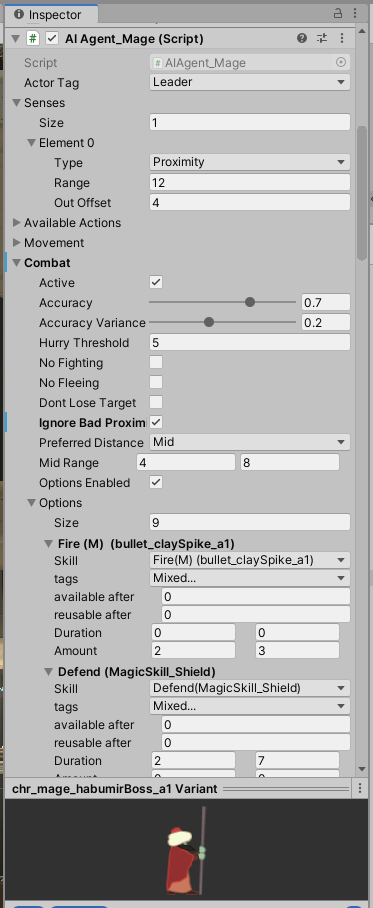
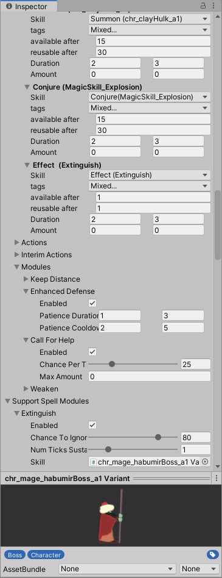

# UNITY-Project - AI-System (work samples)

The following project contains work samples of an C# Unity AI system I wrote for my Unity mage game[^1].

The intention was to create different agent behaviors by simply composing behaviour components (like sensors and skills).
The configuration would be done [within UI (see below)](#action-configuration). The composition is yet [done in code](./Source/Agents/Citizen/AIAgent_CartAnimal.cs).

### Action configuration

In the following screenshots you can see the configurable AI components, such as...

- [Combat settings](./Source/Data/AICombatSettings.cs)
- [Action (skill) options](./Source/Data/AIActionOption.cs)
- [Additional behaviour modules](./Source/Data/Modules)
- [Perceptions](./Source/Perception/ProximityPerception.cs) generated from data [related data models](./Source/Data/PerceptionData.cs)

[^1]: [Mage Trainee game website](https://spiele-oder-so.de/mage-game.html)